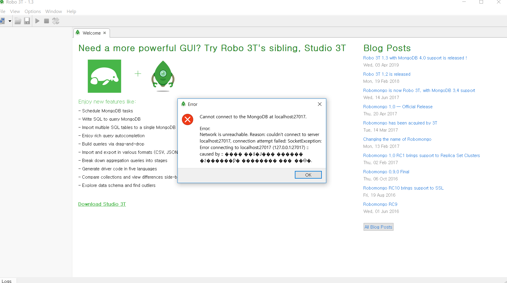
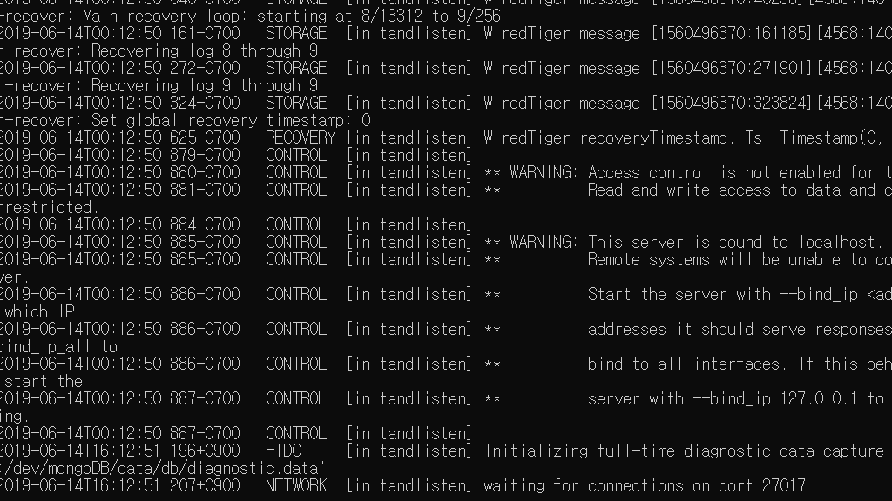

# 사이트명 - RedBook
# 제작자 - 윤동건, 박승진, 최수빈

## 크롤링을 이용한 도서상품 가격비교 사이트<br>

### 사이트의 목적
21세기에는 모든 사람들이 편안함을 추구 합니다. 그로인하여 많은 사람들이 대형마트를 비롯하여 인터넷 쇼핑몰, 등을 이용합니다.<br>
원하는 것을 한눈에 한곳에서 볼 수 있기 때문입니다. <br>
저희는 사람들이 원하는 이 편안함을 좀 더 배가시키기 위하여 이 사이트를 기획하고 설계, 구현 하였습니다. <br>
최근에 사람들은 자기계발 목적이나 본인의 전공분야를 발전시키기 위해 책을 많이 구매하고 읽습니다. <br>
하지만 오프라인으로는 구매를 할 시간이 없고 책을 판매하는 온라인 사이트가 뭐가 있는지 또 각 사이트마다 가격 차이는 얼마나 나는지 알 수 가 없습니다.<br>
그러한 이유로 저희가 만든 사이트는 내가 원하는 책이 어떤 쇼핑몰에서 얼마에 팔고 있는지 어떤 쇼핑몰에서 판매를 하는지 하지 않는지를 쉽게 알려줄 수 있도록 저희는 각 쇼핑몰에서 책을 크롤링하여 한곳에서 한눈에 볼 수 있고 심지어 가격비교까지 할 수 있게 하여 소비자들이 좀 더 합리적인 가격으로 편안하게 책을 구매할 수 있도록 REDBOOK를 제작하였습니다.<br><br>

### 사이트의 개요
저희 프로젝트인 RedBook은 한 사이트에서 도서를 판매하는 여러 사이트들의 책 정보를 크롤링 하여 가격 정보를 한눈에 볼 수 있는 도서 가격 비교 사이트입니다.<br>
책을 구매하는데 앞서 여러 도서 판매 사이트의 정보를 한 번에 얻음과 동시에 장르별, 카테고리 별로 볼 수 있고 검색기능을 활용하여 내가 원하는 도서의 정보를 해당 도서를 판매하고 있는 도서 판매 사이트들을 한 번에 보고 가격을 비교 할 수 있습니다.<br>
도서 정보를 크롤링하는데 사용한 기술은 Scrapy와 Selenium을 사용 하였고, 뷰페이지에는 Flask를 사용하였습니다. 크롤링 한 정보를 통신하기 위해 ajax를 사용하여 동기처리를 하였습니다.<br><br>

### 사용한 기술

Python, MongoDB, Selenium, Scrapy, Json, Flask, Webdriver<br>
Ajax, pymongo, Javascript, css, html

### 사용하기 위한 툴들
프로젝트를 진행하기위하여 다운로드 해야할 Tool들이다.<br>
VisualStudio<br>
다운로드 링크 : https://visualstudio.microsoft.com/downloads/<br>
Python<br>
다운로드 링크 : www.python.org/downloads<br>
Pycharm<br>
다운로드 링크 : https://www.jetbrains.com/pycharm/download/ <br>
MongoDB<br>
다운로드 링크 : https://www.mongodb.com/download-center/community<br>
Robo 3T<br>
다운로드 링크 : https://robomongo.org/download<br>
Webdriver<br>
다운로드 링크 : https://sites.google.com/a/chromium.org/chromedriver/downloads<br>
*참고: webdriver는 다운로드 받은 후에 압축 해제후 C:드라이브 밑에 넣어주세요.(default)
### Python Install
이 프로젝트를 실행하기위해서 install 해야하는 것들이다.
```bash
pip install scrapy
pip install flask
pip install pywin32
pip install selenium
pip install pymongo
```

### Crawling 실행
<code>scrapy</code>를 이용하여 사이트들의 상품을 크롤링한다.
```bash
scrapy crawl interpark_crawl # 인터파크 도서 크롤링
scrapy crawl kyobo_crawl     # 교보문고 도서 크롤링
scrapy crawl yes24_selenium  # yes24 도서 크롤링
```
<br>
크롤링한 값들은 mongoDB에 들어간다.<br>
mongoDB에 들어간 값들을 확인해주기위해 Robo 3T에 접속을 해야한다.

### Robo 3T에 접속 에러가 뜬다면
 몽고DB의 값들을 확인하기 위해 Robo 3T의 서버에 접속하여 확인을 하여야하는데 포트가 설정을 해주지 않아 접속 에러가 뜨는 경우가 있다.<br>
 
 
 자신이 다운로드한 몽고DB path에 \mongoDB\data 밑에 db라는 폴더를 하나 생성해주고
  cmd창에서 입력해준다.
 ```bash
 mongod --dbpath D:\dev\mongoDB\data\db
 ```
 
포트 연결에 성공을 하면 waiting for connections on port 27017 라는 문구가 뜬다.<br>
연결된 cmd창을 꺼주면 포트 연결도 끊기니 연결을 확인한 후 cmd창 켜진 상태로 Robo 3T에 서버에 접속이 가능하다.
 
 
### 크롤링하기 귀찮다면...
Github의 mongoDB파일안의 Redbook안에 크롤링 해놓은 자료가 있는데,<br>
그것을 바탕화면에 다운로드하여서<br>
cmd창에
```bash
mongorestore --db RedBook --dir C:\Users\ezackx\Desktop\RedBook
``` 
입력하시면 크롤링된 값을 몽고디비에 들어간 것을 Roto T3에 접속하여서 확인할 수 있습니다.
### Application 실행
<code>python</code> 명령을 이용하여 웹 어플리케이션을 실행한다.
```bash
python redbook.py
```

### Application 실행 확인
어플리케이션이 정상적으로 실행되면 다음과 같은 결과가 출력된다.
```bash
 * Running on http://127.0.0.1:5000/ (Press CTRL+C to quit)
```


